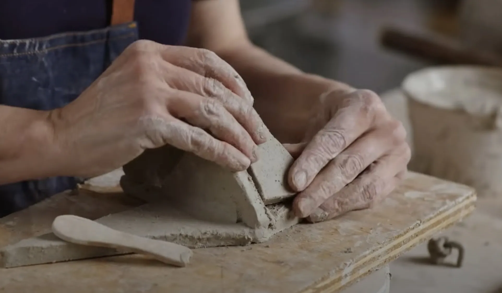

# Programming in Clay

By John Hardy

In January 2025, the US Copyright Office concluded its review of AI-generated content with a finding that every software developer should read carefully. Code produced through conversational prompting of a large language model has no legal author. The human who typed the prompts is not, in the eyes of the law, the creator of the output. The work lands in the public domain by default, unprotectable by any open source or commercial licence. No GPL. No MIT. No proprietary rights of any kind. The code cannot be owned.

That advice arrived just as vibe coding was becoming the default mode of AI-assisted development. The term, coined by researcher Andrej Karpathy early in 2025, describes a workflow most developers now recognise: you describe what you want in a chat window, the model returns code, you iterate on the result, and you ship it. The process is fast and feels productive. What it does not do, per the Copyright Office's January 2025 advice, is produce software that anyone legally owns.

The reason is structural, not incidental. When a programmer describes what they want to an LLM in a chat window, they are modulating an autonomous system rather than controlling a deterministic one. The model makes its own creative decisions about how to fulfil the request. Those decisions, not the programmer's description of them, are what give the code its particular shape. The Copyright Office is measuring the distance between intent and output: when that distance passes through a black box that makes independent creative choices, the human's authorial claim does not survive the crossing.

This piece works through what that means for the software industry, and what a different interaction model would need to look like to restore the authorial chain that vibe coding breaks.

## Vibe Coding and the Authorial Gap

"Vibe coding" is Karpathy's term, and the name fits the practice. You type something like "write me a function that parses CSV files with embedded commas" into a chat window, and the model returns code. You paste it in, run it, find a problem, paste the error back. You iterate. Eventually the code works. You ship it.

What you did in that process was modulate an autonomous system. The LLM is a probabilistic state machine with its own internal logic, its own weights, its own way of resolving ambiguity. When you type a prompt, you are adjusting the environment around that machine. The connection between your instruction and the output passes through a black box you cannot inspect or direct. The creative decisions embedded in the code were made by the model, not by you: the choice of data structures, the error handling strategy, the tradeoffs in the implementation.

That gap is what the Copyright Office is measuring. Authorial content requires a direct chain from human creative intent to the finished work. Prompting breaks that chain.

## A Compiler Is Different

Compare this with a compiler.

When I write C, I am making specific choices at every level: the types I declare, the function signatures, the control flow, the memory management decisions. The compiler translates that into binary deterministically. A specific input always produces a specific output. The binary contains no creative decisions that were not already in my source. It is a mechanical translation of my intent. The compiled programme is mine.

A text editor works the same way. When I select a region and apply a transformation, the editor does exactly what I asked. The result reflects my choices, not the editor’s. These tools are transparent mediators. They carry authorial intent through to the output intact.

A chat-window LLM is not a transparent mediator. It is an autonomous creative system that takes suggestions and produces its own work in response to them. This distinction matters legally and practically.

## The Sculptor Analogy

The sculptor analogy makes the contrast concrete.

A sculptor working in clay is in direct contact with the medium. Every decision is immediate: where the thumb presses, how much material is removed, what the surface texture becomes. The clay has properties that resist and suggest, but every shape it takes is the result of direct physical manipulation. The finished work is the sculptor’s because their creative choices are embedded in every cubic centimetre of it.

A patron who describes a sculpture to a skilled artisan and reviews the result is doing something different. The description might be detailed. The patron might give corrections over several rounds. The final object might match their vision closely. But the creative decisions that went into the making, the moment-by-moment choices about form and surface, belong to the artisan. The patron commissioned the work. They did not make it.

Vibe coding is patron work. The LLM is the artisan. The Copyright Office's advice reflects this accurately.

## The Industry Consequence

The implication for the software industry is large.

Development is moving fast toward vibe-coded workflows. The AI companies are pushing this direction with intent: faster adoption, more usage, more dependence. But every line of vibe-coded software is, per the Copyright Office's advice, public domain on delivery. It cannot be protected by GPL, BSD, MIT, or any open source licence. It cannot be protected by commercial copyright. A company that ships a product built through vibe coding has nothing to licence and nothing to sell. An open source project that accepts vibe-coded contributions cannot meaningfully extend its licence terms to cover those contributions.

Open source licensing depends entirely on the assumption that code has an author whose rights are transferable. If the underlying code cannot be owned, the licence terms have nothing to attach to. Copyleft dies first, because copyleft is a mechanism for asserting ownership strategically. Commercial licence dies alongside it.

This might read as a theoretical problem at present. The structural consequence arrives when the volume of vibe-coded software grows large enough to dominate a codebase. At that point, the codebase’s legal status becomes genuinely uncertain, and so does everything that depends on it.

## The Alternative Interaction Model

The alternative is to change the interaction model.

If prompting is modulation, the solution is to build tools that put the programmer in direct contact with the medium. The goal is a feedback loop tight enough that the programmer’s choices are embedded in the output at every stage, not merely described to an autonomous system and handed back as a result.

This looks less like a chat window and more like an editor. The programmer defines structure: the shape of a module, the contract a function must satisfy, the types that flow through a system. The model expands that structure deterministically, filling in the mechanical consequence of choices the programmer has already made explicitly. When the programmer changes a constraint, the model recalculates. They are not asking; they are shaping. The medium responds to pressure the way clay does: immediately, locally, without independent agenda.

The word that carries the legal weight here is deterministic. A given specification, in a given context, produces the same output every time. This is what makes the output a derivative of the programmer’s choices rather than an autonomous creation. Temperature zero. No probabilistic creative leaps. Mechanical translation of explicit intent into working code.

This is what compilers have always done. The innovation is applying the same principle to a higher-level specification language, one expressive enough to capture design intent while remaining precise enough to drive consistent output.

## The Choice Ahead

The choice the industry faces now is real. The path being actively marketed, faster outputs, more automation, less friction, leads to a world where programmers are patrons and the software they commission belongs to no one. The Copyright Office's advice is not a warning about a possible future. It describes the present.

The sculptor metaphor captures what needs to change. Direct contact with the medium. Choices embedded in the work at every stage. A feedback loop tight enough that the output is a derivative of specific human decisions rather than the autonomous product of a system that was merely pointed in a direction.

That kind of tool is not built yet in the form the problem requires. The chat window is. The vibe coding workflow is. The question is whether the industry builds the alternative before the assumption that software has no author becomes too embedded to examine.
