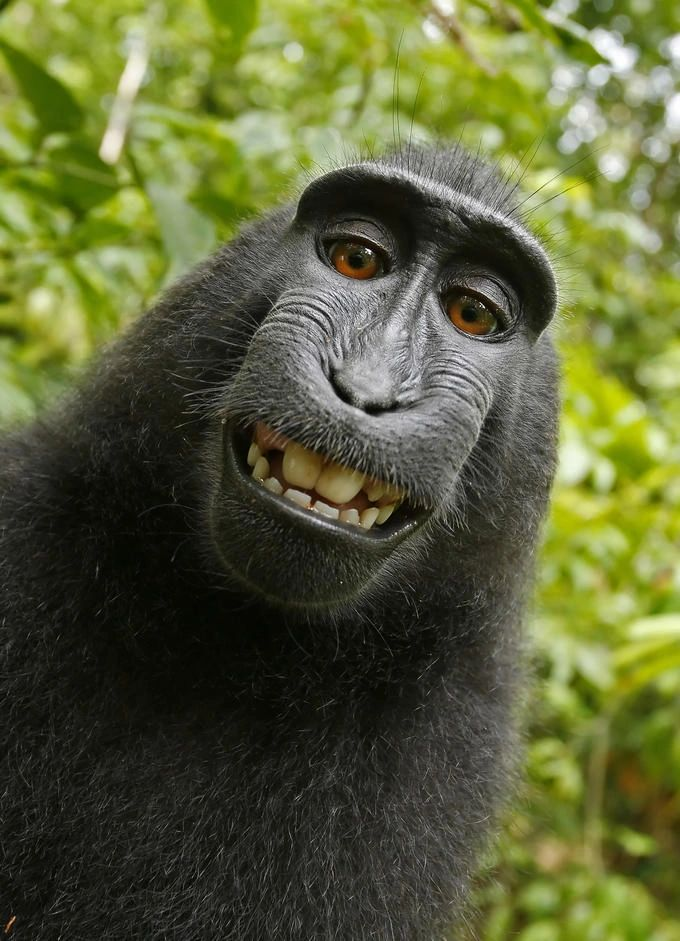

# Can You Own Vibe-Coded Software?

*No human author. No copyright claim.*

There’s an interesting legal question emerging around AI-generated software that reminds me of the famous “monkey selfie” case.

In that case, a photographer owned the camera, set up the conditions, and facilitated the shot but because the monkey actually pressed the shutter, the courts found there was no human author. No human author meant no copyright. And no copyright meant the image effectively fell into the public domain: i.e. nobody could assert any ownership over it.

Now consider large-language-model generated code.

If a developer simply prompts an AI system to produce a loan calculator (or any other software) and ships the result with minimal human authorship over the actual expression of the code, the situation starts to look structurally similar. The U.S. Copyright Office has already taken the position that works generated without “traditional human authorship” are NOT eligible for copyright protection. That doesn’t automatically resolve every case, but it establishes an important default assumption.

If that default holds, the implications are significant:

• Purely AI-generated code may not be copyrightable.

• If it is not copyrightable, IT CANNOT BE OWNED.

• If it cannot be owned, it cannot be licensed in the conventional sense.

That affects not only commercial licensing, but also open source licensing. Licences such as the GNU public license depend entirely on copyright to enforce their terms. Without copyright, the legal mechanism behind “copyleft” weakens or disappears for the AI-generated portions.

This does not mean all AI-assisted software is public domain. Where humans meaningfully design, edit, select, or structure the work, copyright may still attach to those contributions. But the boundary between “tool-assisted authorship” and “machine-generated output” remains largely untested in courts.

We are entering a period where the legal status of software, something the industry has treated as settled for decades, may need to be reconsidered.

If large volumes of production code end up legally uncopyrightable by default, the consequences for ownership, licensing models, and open source ecosystems could be profound.

This space is still evolving, and the unanswered questions are arguably as important as the answers.
