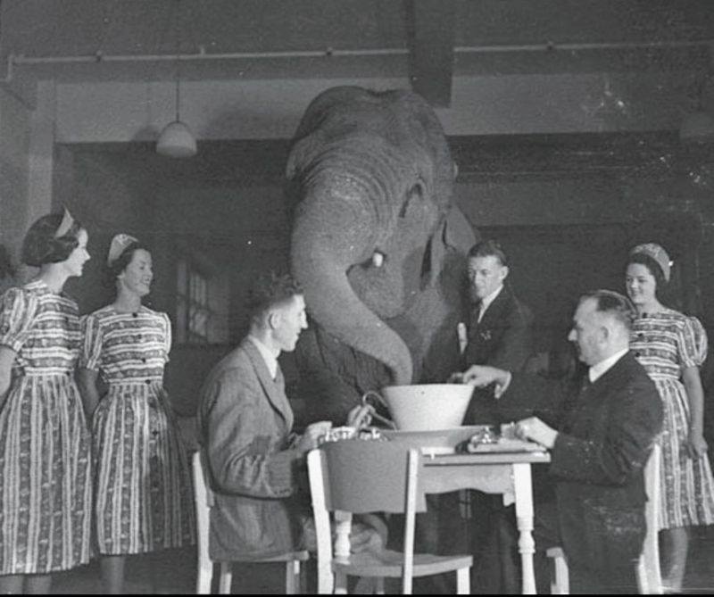

# An elephant in the room too large to see

*An Elephant in the Room Too Large to See*

Software engineers are experiencing massive disruption right now. We're all being told to adopt AI coding tools for productivity gains that are genuinely remarkable. But there's something nobody in our industry is talking about. 

The US Copyright Office has recently advised that AI-generated code that lacks sufficient human creative authorship isn't copyrightable. 

It's public domain. 

What does "lacking sufficient authorship" mean? It means *prompting* the AI isn't authorship. Neither is *specifying requirements*, *guiding* the output, *testing* it, or *validating* it. 

These activities focus on *what* to make, not on *how* it's made. They're about the requirements, not the creative expression. The actual code, the creative expression, comes entirely from the AI which means the software being shipped by companies racing toward AI-driven development may not be legally ownable. 

Engineers need to understand this, because it fundamentally changes what we're actually building and why. Companies are chasing productivity and cost savings without reckoning with a fundamental legal problem: they may not own the output. This isn't a complaint about disruption, it's a flag about an elephant in the room that's so big nobody's even noticed it yet! 

Does your company know that the software that they are paying so much money to Microsoft, Anthropic and OpenAI to develop is probably not copyrightable and is therefore in the public domain?
