# Atom, a new Z80 assembler

By John Hardy

I’m just putting the finishing touches to my Z80 assembler, which I call Atom.

It runs on macOS, Windows, Linux … and CP/M.

The assembler itself is written in Z80 assembly. On modern computers, the Z80 code runs in an emulator. Under CP/M, it runs directly on the processor. The same assembly engine works in both environments.

It fits within 16 KiB and can assemble its own source, reproducing the executable byte for byte.

Atom reads source as a stream, in a single pass. Forward references are the interesting complication: an instruction can refer to a label whose address hasn’t been established yet. Atom records the unresolved reference and produces a patch when the label is defined. There’s no second trip through the source.

<figure>
  
  <figcaption>In Atom’s NOBJ format, IMAGE records contain the initial bytes and PATCH records carry the final replacements for unresolved references.</figcaption>
</figure>

It supports the complete Z80 instruction set, including the undocumented instructions. Both the desktop and CP/M commands can produce binary, COM and Intel HEX files. On the desktop, Node.js handles the files and preprocessing; the assembly happens inside the emulated Z80.

There are a few more places that little Z80 core will turn up. More on those later.

The [Atom books at Debug80](https://debug80.com/atom/) cover the assembler and Z80 programming. [The source now has its own repository](https://github.com/jhlagado/atom), under the GPL v3 licence.
