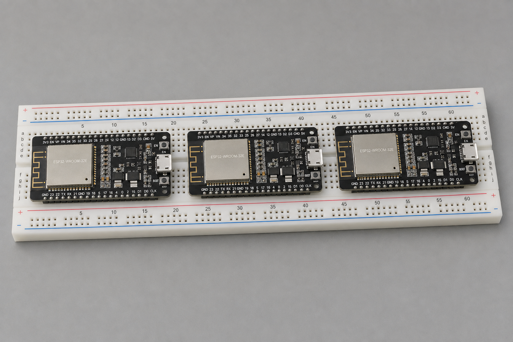

# Triptych, a retro computer in three parts

By John Hardy

<figure class="article-figure">
  
  <figcaption>Concept illustration of the three-board design. This illustration is public domain.</figcaption>
</figure>

I’m developing a retro computer around three ESP32 microcontroller boards. I call it Triptych because each board takes on a different subsystem: CPU and bulk storage, video, and sound. I’m currently working on the CPU board, with a design that emulates a Z80 and runs CP/M. The second board is for generating VGA signals to drive a monitor, and the third is for sound generation. The goal is a 1980s-style computer that you can develop software on directly, much as people did with the Commodore 64, TRS-80 or Apple II. I’ll be posting my progress here as the system takes shape.
