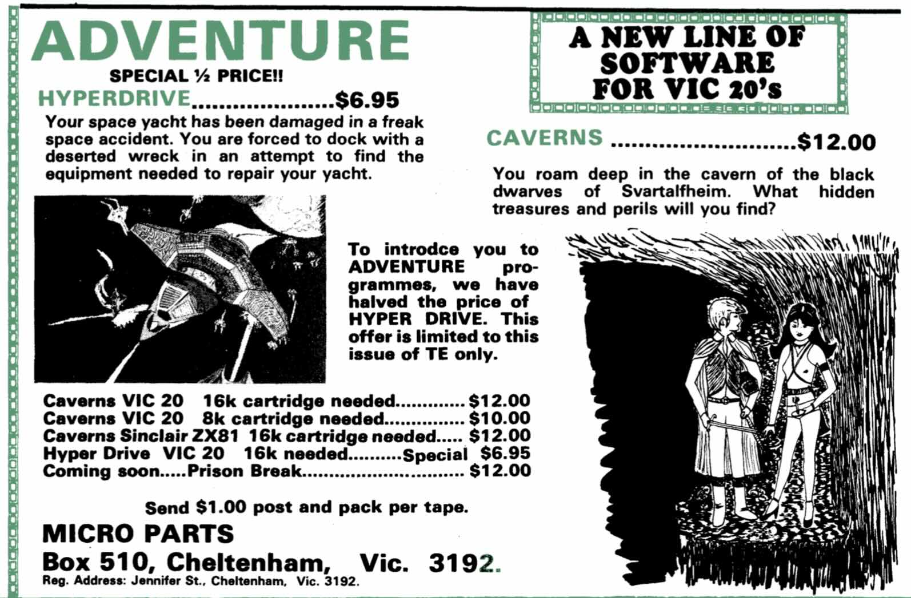

# Recovering Hyperdrive, part one: a very old cassette

By John Hardy

<figure>
  
  <figcaption>Micro Parts advertises Hyperdrive and Caverns in Talking Electronics, issue 8. The Hyperdrive repository holds this scan.</figcaption>
</figure>

Memory is a peculiar thing to rely on when you're trying to describe something you did nearly forty-five years ago. I can remember spending hours on a project and knowing its details thoroughly, then going for decades without giving it much thought. The broad outline is familiar enough, but the decisions, the small discoveries and the things that seemed obvious at the time are much harder to recover. I'd like to think the right prompt could bring it all back. In practice, remembering feels more like working from the pieces I still have and trying to make sense of how they fit together.

The psychologist Frederic Bartlett described remembering as “an imaginative reconstruction, or construction” in his 1932 book *Remembering*. A small fact can bring back something I haven't thought about in years, and then I can work backwards: if we did that, we must already have worked out this other thing. Some possibilities fall away and others begin to make sense. Talking to someone who was there can help, although I don't know how much confidence to place in an account simply because we agree on it. We may have remembered something together, or arrived at a plausible explanation that has started to feel like a memory. A surviving object gives us something to check those memories against.

In this case, the object was a cassette containing Hyperdrive, a text adventure Ken Stone wrote in the early 1980s. He'd finished the game and put it on cassette, then, as computers and his interests moved on, lost the ability to run it or even read the code. Around Christmas 2025, I worked to recover it from an audio recording of Ken's surviving tape. I hadn't expected how much of our early programming days would come back as I began to read his game again.

Hyperdrive grew out of Caverns, an adventure I started on a Sinclair ZX81 with a 16K RAM expansion in 1981. By 1982, I'd developed it into a substantial game. Caverns became a collaboration between Ken and me. We wrote it in numbered BASIC lines, mixing room descriptions, directions and objects with the conditions that made the puzzles work. You could spend a long time on quite a small piece of the adventure because you had to account for every possibility. For a locked door, we needed a way to record its state, a way for the player to unlock it, and something sensible to print when they tried to walk through it too soon. Even with the extra memory, fitting an adventure into one of these machines meant paying attention to how much room you had left.

Ken bought a VIC-20 in 1982, and I remember us entering the Caverns code into it largely by hand. Ken used my Caverns code as a starting point for Hyperdrive, but the adventure was entirely his work. He wrote the story and all its text, and created the setting, ideas and puzzles around exploring a derelict spacecraft and finding what you needed to get home. A compass is an odd thing to need aboard a spacecraft, but it had been useful in Caverns and came along for the ride. I like those little leftovers. In Ken's game I can still recognise bits of the Caverns code we worked on together.

Ken sold both games on cassette through his business, Micro Parts. The advertisement above lists Hyperdrive and Caverns with their descriptions, prices and memory requirements, the details someone would need when deciding what to buy for their computer. Hyperdrive needed a 16K VIC-20 expansion. I don't have to reconstruct that detail from a hazy impression of Ken's machine; I can read it in the ad.

But the Commodore 64 soon overshadowed the VIC-20, and interest in VIC-20 software fell away. Eventually Ken no longer had a machine to load his cassette into. Attempts to get the game back led to dead ends; knowing there might be a program on the tape was a long way from being able to see it. Ken had given up hope of ever seeing his work again. Luckily, he's the sort of person who never throws things away, and he'd kept the cassette through all those years when he had no obvious use for it.

At some point Ken recorded the tape as a WAV file, preserving it as digital audio. Later, after I'd recovered some of my own early work, he asked whether there was any chance I could do something with his recording. I'd received a lot of help from other people with that earlier recovery, which is a story of its own. I could make copies of the recording and try different approaches without repeatedly playing an ageing cassette.

Magnetic tape can deteriorate, and copying it into a digital file preserves any gaps or distortion along with the data. I might have been able to recover fragments, or nothing useful at all. Fortunately, enough of the game had survived for me to recover it, though I didn't know that when I started. I'd initially expected Commodore to store the data by switching between audio frequencies; they used the timing of pulses. Before I could judge whether anything was missing, I had to understand what I was listening to and how to turn it back into bytes.

My initial ambition was fairly modest: recover enough readable BASIC to find out what Ken had written. I would have accepted an uppercase listing and given up the presentation details if necessary. Even that would have let me read the descriptions, follow the map and examine the puzzles again. Getting from bytes to readable text meant understanding the structure of the saved BASIC and the VIC-20's own character encoding. At first, some of the output looked like damaged text, with dots and unfamiliar symbols in places where I expected words. I couldn't yet tell how much text was missing and how much I simply wasn't interpreting correctly.

The investigation produced several recovery programs and intermediate listings, which I've since gathered together with the recording and recovered source. Comparing them gives me a way of tracing the refinements, rather than relying entirely on what I remember of the process. As I learnt more about the VIC-20, I realised I could recover the original mix of upper- and lowercase text. Then I became interested in recovering the colour and sound as well. Each detail I recognised gave me a reason to investigate the next one, and the job gradually grew beyond getting the words out.

Reading the recovered game also gave me something concrete to attach the older memories to. The compass was there in the code, a surviving connection between Ken's spacecraft and our caves. I could use details like that to check parts of the story and recover connections I'd long since stopped thinking about. I could never have recreated Hyperdrive from memory, but with the program in front of me I recognised things I couldn't have brought to mind on my own. After all that time, I could run Ken's game again and read through work he'd thought was gone for good. I had set out to recover Ken's game, and found myself remembering the work we'd done together on Caverns.

In the next article, I'll go through the steps from the cassette recording to readable BASIC, including the false starts and the apparently missing text that turned out to have been there all along.
